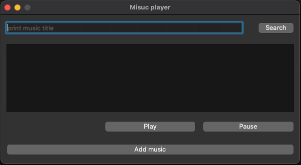
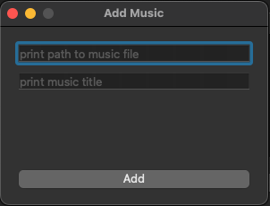

# music_online_platform

## Описание

MOP

Приложение для прослушивания музыки онлайн

## Функции
* Поиск трека по названию
* Прослушивание треков онлайн
* Загрузка новых треков с указанием названия и пути до файла с музыкой

## Итерфейс
* GUI - оконное приложение
* Главное окно 

    - Поисковая строка и кнопка "поиск"
    - Пустое окно в котором позднее будут выводиться найденые треки
    - Пустое окно в котором позднее будет выводится воспроизводимый в данный момент трек
    - Кнопка "Добавить музыку"
* При нажатии на кнопку "поиск"
    - Выводится список треков, в которых есть совпадение по названию
    - При нажатии на трек из списка он начинает воспроизводится и показывается в специальном окне
    - Можно искать другие треки, при этом воспроизведение трека не прервется
    - Если поисковая строка пуста, ничего не произойдет
* При нажатии на кнопку "Добавить музыку"

    - В отдельном окне можно ввести путь до нового музыкального трека, его название и отправить его на сервер

## Технологии
* Для GUI - PyQt
* Для хранения треков на сервере - подпрогамма, которая по названию возвращает mp3 файл из католога на сервере
* Для взаимодействия с сервером - через сокет
